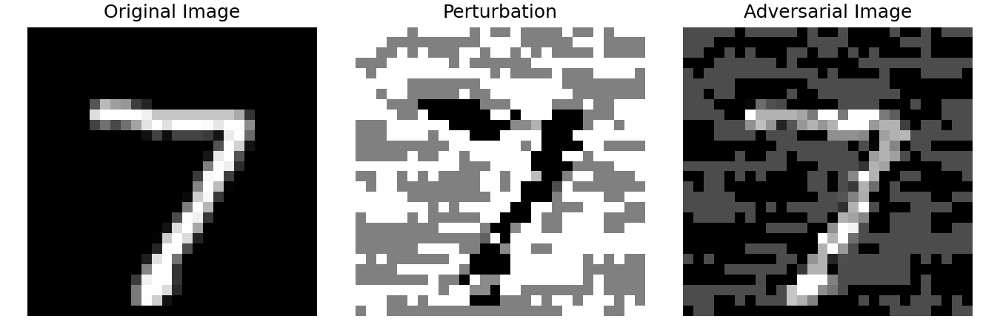
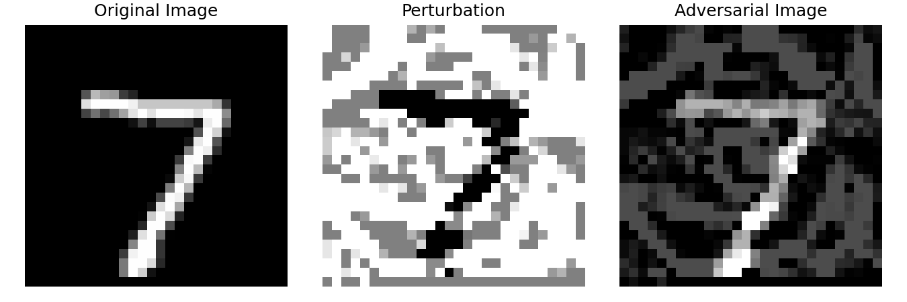

# MNIST 对抗样本攻击与鲁棒性评估

本项目基于 PyTorch 构建 MNIST 手写数字分类模型，并实现 FGSM 与 PGD 两种典型对抗攻击方法。项目包含模型训练、攻击生成、鲁棒性评估和对抗样本可视化，可用于理解图像分类模型在扰动输入下的性能变化。

## 项目亮点

- 使用 `SimpleCNN` 完成 MNIST 手写数字分类。
- 实现 FGSM 一步梯度符号攻击。
- 实现 PGD 多步迭代投影攻击。
- 支持 Clean Acc、Robust Acc、Attack Success Rate 三类指标评估。
- 提供对抗样本可视化，展示原图、扰动和攻击后图片。
- README 记录真实运行结果，未手工伪造指标。

## 项目结构

```text
adversarial_image_lab/
|-- attacks/
|   |-- fgsm.py
|   `-- pgd.py
|-- eval/
|   `-- metrics.py
|-- models/
|   `-- simple_cnn.py
|-- results/
|   |-- fgsm_eps_0.3_example.png
|   `-- pgd_eps_0.3_example.png
|-- utils/
|   `-- visualize.py
|-- evaluate_attack.py
|-- requirements.txt
|-- train.py
|-- visualize_attack.py
`-- README.md
```

## 环境依赖

```bash
pip install -r requirements.txt
```

`requirements.txt` 包含：

```text
torch
torchvision
matplotlib
pillow
numpy
```

## SimpleCNN 模型

模型文件位于 `models/simple_cnn.py`。输入为 MNIST 单通道灰度图，尺寸为 `28 x 28`。

Shape 变化如下：

```text
输入:      [64, 1, 28, 28]
conv1:    [64, 16, 28, 28]
pool1:    [64, 16, 14, 14]
conv2:    [64, 32, 14, 14]
pool2:    [64, 32, 7, 7]
flatten:  [64, 1568]
fc1:      [64, 128]
fc2:      [64, 10]
```

其中 `1568 = 32 x 7 x 7`，最终输出的 `10` 对应 MNIST 的 10 个数字类别。

## FGSM 原理

FGSM 全称为 Fast Gradient Sign Method，是一种一步攻击方法。它计算分类损失对输入图片的梯度，然后沿着让损失增大的方向修改像素。

公式：

```text
x_adv = x + epsilon * sign(gradient_x J(theta, x, y))
```

在代码中对应：

```text
adv_images = images + epsilon * images.grad.sign()
```

含义：

- `x`：原始图片。
- `y`：真实标签。
- `theta`：模型参数。
- `J(theta, x, y)`：分类损失。
- `epsilon`：扰动强度。
- `sign(...)`：取梯度符号，只保留每个像素的修改方向。

`epsilon` 越大，扰动越强，通常攻击成功率越高。

## PGD 原理

PGD 可以看作多步版本的 FGSM。它先在原图附近随机初始化一个扰动点，然后多次沿梯度方向更新对抗样本，并在每一步后把扰动投影回允许范围内。

核心过程：

```text
x_adv = x_adv + alpha * sign(gradient_x J(theta, x_adv, y))
perturbation = clamp(x_adv - x, -epsilon, epsilon)
x_adv = clamp(x + perturbation, 0, 1)
```

关键参数：

- `epsilon`：允许的最大总扰动范围。
- `alpha`：每一步更新的步长。
- `steps`：迭代次数。

在相同 `epsilon` 下，PGD 通常比 FGSM 更强，因为它会进行多轮搜索。

## 评估指标

- `Clean Acc`：模型在干净测试集上的准确率，用于衡量正常分类能力。
- `Robust Acc`：模型在对抗样本上的准确率，用于衡量攻击下仍能分类正确的比例。
- `Attack Success Rate`：攻击成功率。本项目中按 `1 - Robust Acc` 计算。

## 真实运行结果

以下结果由项目脚本实际运行得到，使用模型权重 `simple_cnn_mnist.pth`。

运行命令：

```bash
python evaluate_attack.py --attack none --model-path simple_cnn_mnist.pth
python evaluate_attack.py --attack fgsm --epsilon 0.1 --model-path simple_cnn_mnist.pth
python evaluate_attack.py --attack fgsm --epsilon 0.2 --model-path simple_cnn_mnist.pth
python evaluate_attack.py --attack fgsm --epsilon 0.3 --model-path simple_cnn_mnist.pth
python evaluate_attack.py --attack pgd --epsilon 0.3 --alpha 0.01 --steps 40 --model-path simple_cnn_mnist.pth
```

| Model | Attack | Epsilon | Alpha | Steps | Clean Acc | Robust Acc | Attack Success Rate |
|---|---|---:|---:|---:|---:|---:|---:|
| SimpleCNN | None | 0 | - | - | 98.71% | - | - |
| SimpleCNN | FGSM | 0.1 | - | 1 | 98.71% | 84.08% | 15.92% |
| SimpleCNN | FGSM | 0.2 | - | 1 | 98.71% | 33.54% | 66.46% |
| SimpleCNN | FGSM | 0.3 | - | 1 | 98.71% | 6.67% | 93.33% |
| SimpleCNN | PGD | 0.3 | 0.01 | 40 | 98.71% | 0.00% | 100.00% |

结果说明：

- 干净样本准确率为 `98.71%`，说明模型在正常 MNIST 测试集上表现较好。
- FGSM 的 `epsilon` 从 `0.1` 增大到 `0.3` 时，`Robust Acc` 从 `84.08%` 降到 `6.67%`。
- PGD 在 `epsilon=0.3`、`alpha=0.01`、`steps=40` 下使 `Robust Acc` 降到 `0.00%`，攻击强度明显高于 FGSM。

## 对抗样本可视化

可视化脚本：

```bash
python visualize_attack.py --model-path simple_cnn_mnist.pth
```

生成图片：

```text
results/fgsm_eps_0.3_example.png
results/pgd_eps_0.3_example.png
```

FGSM 可视化：



PGD 可视化：



每张图从左到右分别为：

- `Original Image`：原始 MNIST 图片。
- `Perturbation`：放大显示后的扰动。
- `Adversarial Image`：攻击后的图片。

## 运行方法

训练模型：

```bash
python train.py --epochs 3
```

检查干净测试集准确率：

```bash
python evaluate_attack.py --attack none --model-path simple_cnn_mnist.pth
```

运行 FGSM：

```bash
python evaluate_attack.py --attack fgsm --epsilon 0.3 --model-path simple_cnn_mnist.pth
```

运行 PGD：

```bash
python evaluate_attack.py --attack pgd --epsilon 0.3 --alpha 0.01 --steps 40 --model-path simple_cnn_mnist.pth
```

生成对抗样本图片：

```bash
python visualize_attack.py --model-path simple_cnn_mnist.pth
```

## 后续优化方向

- 使用 CIFAR-10 数据集进行彩色图像分类与攻击评估。
- 替换 SimpleCNN 为 ResNet，提高模型表达能力。
- 加入对抗训练，提升模型鲁棒性。
- 系统比较 FGSM 与 PGD 在不同参数下的攻击效果。
- 增加更严格的鲁棒性评估方式，例如只统计原本干净样本预测正确的样本。
